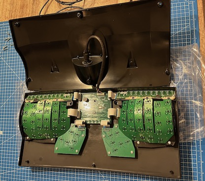
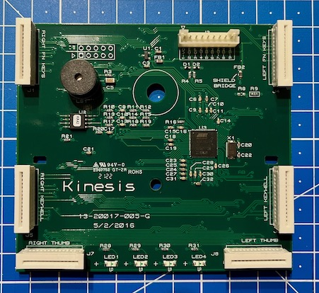
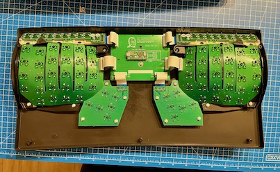

# Kinesis Advantage2

## Teardowns

[{ style="width:30%" }](images/ka2-smartset.jpeg)
[{ style="width:30%" }](images/ka2-smartset-controller.jpeg)
[{ style="width:30%" }](images/ka2-kint.jpeg)

*KB600 from left to right: SmartSet, SmartSet close-up, KinT*

## Controllers

### SmartSet

The default logic board with the SmartSet 4MiB firmware uses an [Atmel
AT32UC3B0256](https://www.microchip.com/en-us/product/AT32UC3B0256)
microcontroller. The default SmartSet firmware supports key remappings, macros
and even some support for tap-and-hold. The SmartSet firmware has three programming
interfaces: (1) on-keyboard; (2) through the SmartSet software; and (3) through
text files that describe rules. The last two methods require exporing the settings
through the so-called V-Drive. The V-Drive exposes the settings as a virtual drive
with the FAT filesystem.

The SmartSet firmware has limitations compared to popular open source firmwares
like [QMK](https://qmk.fm). For instance, SmartSet on the KA2 only supports two
layers. Some Advantage2 users replace the controller board to run open source
firmware. Replacing the controller is fairly simple, since the key wells, thumb
clusters, and function key rows connect to the logic board with removable ribbon
cables.

### KinT

The most popular alternative controller is the
[KinT](https://github.com/kinx-project/kint). KinT and QMK support multiple
[Teensy](https://www.pjrc.com/teensy/) microcontroller models. The project also
provides Gerber files to get PCB produced. The maker of the KinT controller has
made a really nice [build video](https://www.youtube.com/watch?v=I0kwQbnhlfk).
If you find building a KinT to daunting, presoldered KinT controllers are often
offered on eBay.

### KinT Blackpill Edition

The [KinT Blackpill Edition](https://github.com/dcpedit/kint) is a modification
of the KinT that uses a Blackpill microcontroller with an USB-C connector.

### USB cable and alternative controllers

Replacement controllers do not have a JST male plug to use the original Kinesis
USB cable. I am not a 100% sure, but I think the issue is that the Teensy
microcontrollers do not break out pins for the USB D+/D- wires. At any rate,
people have used different solutions to this:

* Plug a cable in the Teensy and route it through the USB cable hole. Downsides:
  dust can get in, easy to damage the Teensy.
* Mount a USB panel to the back and plug it in the Teensy. You could even use
  the e-clip of the original cable with this [3D printable
  mount](https://github.com/dcpedit/kinesismod/blob/master/model/kinesis_ush_mount.STL).
  I tried this solution, but unfortunately the e-clip would break the mount.
* Strip a Micro-B cable and [solder a JST male connector to
  it](https://github.com/kinx-project/kint/issues/9#issuecomment-774753427).
  The connector type on the KB600 normally seems to be a 9 pin JST connector
  with 2mm pitch. Advantage: you can use the original KA2 USB cable unchanged.
  Disadvantages: soldering USB wires to a connector with 2mm pitch is difficult;
  very easy to cause shorts between wires.
* Strip a Micro-B cable and the original KA2 USB cable, solder the corresponding
  wires, and isolate (e.g. using masking tape). Disadvantage: modification of
  the original cable, advantage: easier to do safely.

